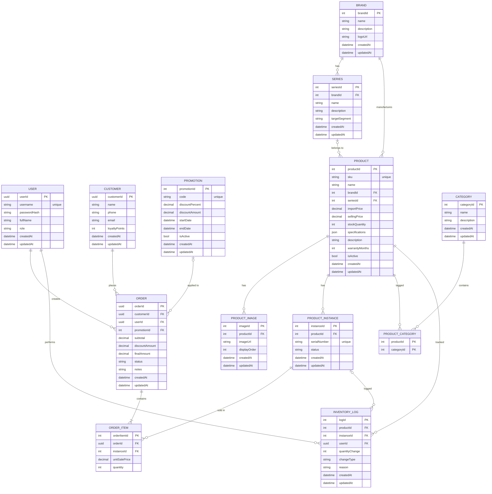
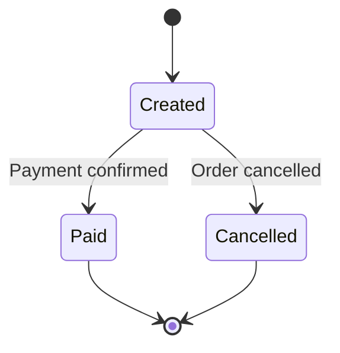
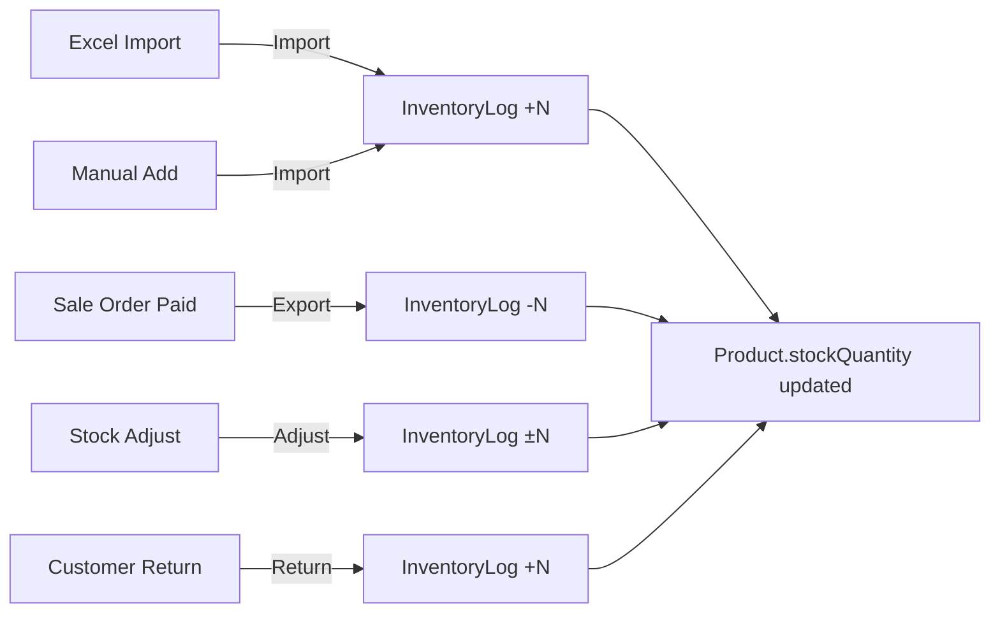

# Entity Relationship Diagram

## ERD Overview (Mermaid)

## Relationship Summary

### Master Data (static/reference)
| Entity | Description |
|--------|-------------|
| **User** | Shop staff. Role = Admin (full access) or Sale (limited: can't see import price) |
| **Brand** | Laptop manufacturer: ASUS, Dell, HP, Lenovo, Acer, MSI, Apple |
| **Series** | Product line within a brand: ROG, TUF, ThinkPad, Legion, etc. |
| **Category** | Product classification: Gaming, Business, Student, Ultrabook, Workstation |
| **Promotion** | Discount codes with date range and percent/amount off |

### Transaction Data (generated over time)
| Entity | Description |
|--------|-------------|
| **Product** | A laptop model with specs, prices, stock count |
| **ProductInstance** | Individual physical laptop with unique serial number |
| **ProductImage** | Product photos (min 3 per product per requirements) |
| **ProductCategory** | Many-to-many join: one product can be in multiple categories |
| **Customer** | Buyer info + loyalty points |
| **Order** | Sale transaction. Status flow: Created → Paid / Cancelled |
| **OrderItem** | Line item linking order to a specific serial (ProductInstance) |
| **InventoryLog** | Audit trail for stock changes (import, export, adjust, return) |

## Key Design Decisions

1. **Serial-based sales**: Each laptop sold is tracked by serial number (ProductInstance), not just quantity. OrderItem references a specific instance.

2. **Soft delete on Product**: `isActive = false` instead of physical delete, preserving order history.

3. **JSONB specifications**: Flexible schema for laptop specs (CPU, RAM, GPU, screen size, storage) — avoids rigid columns for varying attributes.

4. **Price types**: `importPrice` (cost) + `sellingPrice` (retail). Admin sees both, Sale role sees only sellingPrice.

5. **Composite PK**: ProductCategory uses (productId, categoryId) composite key with cascade deletes.

6. **UUID for people/orders**: User, Customer, Order use UUID. Auto-increment int for products/brands/categories (simpler queries).

## Order Status Flow

## Inventory Flow

