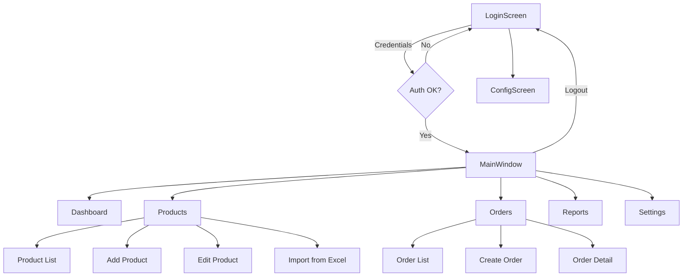

# Feature Specifications

## Screen Map



---

## Config vs Settings

> **Config** = pre-login setup to connect to the server. **Settings** = post-login user preferences.

| | Config | Settings |
|---|---|---|
| **When** | Before login | After login |
| **Purpose** | Configure connection to reach the server | Personalize app behavior |
| **Examples** | Server URL/IP, port | Items per page, theme, last screen |
| **Who uses** | Deployer / IT / shop owner on first install | Daily user |
| **Storage** | Local config file (persists across logins) | Local settings file (per-user prefs) |

**Instructor's explanation**: During development, the app connects to a default local server (localhost). When deploying to a customer, the ConfigScreen lets them set the server address, port, and connection info. This is deployment-level configuration, separate from user preferences (Settings).

---

## B1. Login + ConfigScreen (0.25 pts)

**Screens**: LoginScreen, ConfigScreen

### Requirements
- [ ] Auto-login if credentials saved from last session
- [ ] Credentials must be encrypted (JWT stored locally, not plaintext password)
- [ ] Display app version number on login screen
- [ ] ConfigScreen accessible from LoginScreen (before login)
- [ ] ConfigScreen fields: Server URL (default: `http://localhost:4000/graphql`)

### ConfigScreen
Accessible from the LoginScreen via a gear/settings icon. Allows the user to configure:

| Field | Default | Description |
|-------|---------|-------------|
| Server URL | `http://localhost:4000/graphql` | GraphQL API endpoint |

Saved to a local JSON file (e.g., `config.json` in app's local storage). The app reads this on startup to know where to send GraphQL requests. If the server is unreachable, show an error on the LoginScreen.

### GraphQL Operations
```graphql
mutation login($username: String!, $password: String!) {
  login(username: $username, password: $password) {
    token
    user { userId username role fullName }
  }
}

query me {
  me { userId username role fullName }
}
```

### Flow
1. App starts → read `config.json` for server URL
2. Check for stored JWT
3. If JWT exists → call `me` query to validate
   - Valid → go to MainWindow (last opened screen from Settings)
   - Invalid/expired → show LoginScreen
4. If no JWT → show LoginScreen
5. User can open ConfigScreen to change server URL
6. User enters username + password → call `login` mutation
7. On success → store JWT locally (encrypted) → navigate to MainWindow

### Data
- Default users: `admin/admin123` (Admin), `sale/sale123` (Sale)
- JWT expires in 7 days

---

## B2. Dashboard (0.5 pts)

**Screen**: DashboardPage

### Requirements
- [ ] Total product count
- [ ] Top 5 products nearly out of stock (quantity < 5)
- [ ] Top 5 best-selling products
- [ ] Total orders today
- [ ] Total revenue today
- [ ] 3 most recent orders with details
- [ ] Revenue chart: daily for current month (line chart)

### GraphQL Operations (to be added to backend)
```graphql
query dashboardStats {
  dashboardStats {
    totalProducts
    totalOrdersToday
    totalRevenueToday
    lowStockProducts { productId name stockQuantity }
    topSellingProducts { productId name totalSold }
    recentOrders { orderId finalAmount status createdAt customer { name } }
    dailyRevenue { date revenue }
  }
}
```

### UI Components
- KPI cards: total products, orders today, revenue today
- Table: low stock products (name, qty, warning icon)
- Table: top selling products (name, total sold)
- Table: recent 3 orders (id, customer, amount, status, date)
- Line chart: daily revenue for current month (LiveCharts2)

---

## B3. Products Management (1.25 pts)

**Screens**: ProductsPage → AddProductPage / EditProductPage

### Requirements
- [ ] List products by category (tab or dropdown filter)
- [ ] View detail → Edit / Delete
- [ ] Pagination (configurable page size from Settings: 5/10/15/20)
- [ ] Sort by one criteria (name, price, stock, date)
- [ ] Filter by price range (min-max slider or input)
- [ ] Search by product name keyword
- [ ] Add new category
- [ ] Add new product (manual form)
- [ ] Import products from Excel file

### Product vs ProductInstance (Serial Management)

Each **Product** is a laptop model (e.g., "ASUS ROG Strix G16"). Each **ProductInstance** is a physical unit with a unique serial number.

```
Product: ASUS ROG Strix G16 (stockQuantity = 3)
├── Instance: SN-ROG-001 (Available)
├── Instance: SN-ROG-002 (Available)
└── Instance: SN-ROG-003 (Sold)
```

- `Product.stockQuantity` is a **cached counter** for fast display
- The real source of truth is the count of `ProductInstance` rows with status = "Available"
- Both must stay in sync: any mutation that changes instances also updates `stockQuantity`

### Product Images

Images are stored on the server filesystem and served via HTTP:

```
Upload:  Client → POST /uploads → Server saves to /uploads/products/xxx.jpg → returns URL
Display: Client → Image.Source = "http://localhost:4000/uploads/products/xxx.jpg"
Store:   ProductImage.imageUrl = "/uploads/products/xxx.jpg"
```

- Server serves static files: `app.use('/uploads', express.static('uploads'))`
- WinUI `Image` control loads from HTTP URL directly
- Minimum 3 images per product (instructor requirement)

### GraphQL Operations
```graphql
# List with filters
query products(
  $search: String
  $categoryId: Int
  $brandId: Int
  $minPrice: Float
  $maxPrice: Float
  $sortBy: String
  $sortOrder: String
  $page: Int
  $pageSize: Int
) {
  products(...) {
    items {
      productId sku name sellingPrice stockQuantity isActive
      brand { name }
      categories { name }
      images { imageUrl }
    }
    totalCount page pageSize
  }
}

# Single product detail
query product($productId: Int!) {
  product(productId: $productId) {
    productId sku name description
    importPrice sellingPrice stockQuantity
    warrantyMonths specifications
    brand { brandId name }
    series { seriesId name }
    categories { categoryId name }
    images { imageId imageUrl displayOrder }
    instances { instanceId serialNumber status }
  }
}

# CRUD
mutation createProduct($input: CreateProductInput!) { ... }
mutation updateProduct($productId: Int!, $input: UpdateProductInput!) { ... }
mutation deleteProduct($productId: Int!) { ... }  # soft delete: isActive = false
```

### Data Requirements
- Minimum 3 categories
- Minimum 22 products per category
- Minimum 3 images per product
- Data should look realistic (real laptop names, specs, prices in VND)

### Role-based visibility
- **Admin**: sees both importPrice and sellingPrice
- **Sale**: sees only sellingPrice

---

## B4. Orders Management (1.5 pts)

**Screens**: OrdersPage → CreateOrderPage / OrderDetailPage

### Requirements
- [ ] Create new order (select customer, add products by serial)
- [ ] Delete an order (only if status = Created)
- [ ] Update an order (change items, update status)
- [ ] List orders with pagination
- [ ] View order detail
- [ ] Search orders by date range (from-to)
- [ ] Status management: Created → Paid / Cancelled

### Order Creation Flow (serial-based)
1. Select or create customer
2. Search products → see available ProductInstances (serial numbers)
3. Pick specific serial numbers to add to the order
4. Each serial added as a line item with its selling price
5. Apply promotion code (optional)
6. Calculate subtotal, discount, final amount in real-time
7. Confirm → status = Created
8. Mark as Paid or Cancelled later

### Inventory Sync on Status Change

**When order status → Paid:**
- Each OrderItem's `ProductInstance.status` → "Sold"
- Each `Product.stockQuantity` decremented by items sold
- `InventoryLog` entries created (changeType = "Export")

**When order status → Cancelled (from Created):**
- No inventory impact (stock wasn't touched yet)

**Cannot delete a Paid order** — preserves sales history.

### GraphQL Operations (to be added to backend)
```graphql
query orders(
  $status: String
  $fromDate: String
  $toDate: String
  $search: String
  $page: Int
  $pageSize: Int
) {
  orders(...) {
    items {
      orderId status finalAmount createdAt
      customer { name phone }
      user { fullName }
      orderItems {
        instance { serialNumber product { name } }
        unitSalePrice quantity
      }
    }
    totalCount page pageSize
  }
}

mutation createOrder($input: CreateOrderInput!) { ... }
mutation updateOrderStatus($orderId: ID!, $status: String!) { ... }
mutation deleteOrder($orderId: ID!) { ... }
```

---

## B5. Reports (1.0 pts)

**Screen**: ReportPage

### Requirements
- [ ] Products sold by quantity: filter by day/week/month/year range → line chart
- [ ] Revenue report: filter by day/week/month/year range → bar/pie chart
- [ ] Profit report: (sellingPrice - importPrice) per item → same filters

### GraphQL Operations (to be added to backend)
```graphql
query salesReport(
  $fromDate: String!
  $toDate: String!
  $groupBy: String!  # "day" | "week" | "month" | "year"
) {
  salesReport(fromDate: $fromDate, toDate: $toDate, groupBy: $groupBy) {
    period
    totalQuantity
    totalRevenue
    totalProfit
  }
}

query topProducts(
  $fromDate: String!
  $toDate: String!
  $limit: Int
) {
  topProducts(...) {
    productId name totalSold totalRevenue
  }
}
```

### Charts (LiveCharts2)
- Line chart: quantity sold over time
- Bar chart: revenue per period
- Pie chart: revenue by category or brand

---

## B6. Settings (0.25 pts)

**Screen**: SettingsPage (accessible after login)

### Requirements
- [ ] Configure items per page for pagination (5/10/15/20)
- [ ] Remember last active screen on app restart
- [ ] Theme preference (optional)

### Storage
- Local settings file (JSON) on the client side
- Per-machine, per-user preference
- Not stored in database
- Read on app startup after successful login

---

## B7. Installer Package (0.25 pts)

- [ ] Package WinUI 3 app as MSIX or exe installer
- Use Visual Studio packaging project or `dotnet publish`

---

## Bonus Features (selected)

### GraphQL API (+1.0 pt) ✅ Already implemented

### MVVM (+0.5 pt) ✅ Already using CommunityToolkit.Mvvm

### Dependency Injection (+0.5 pt) ✅ Already using Microsoft.Extensions.DI

### Promotions (+1.0 pt)
- [ ] Create/edit/delete promotion codes
- [ ] Apply to orders during creation
- [ ] Validate date range and active status
- [ ] Calculate discount (percent or fixed amount)

### Role-based Access (+0.5 pt)
- [ ] Admin: full access, sees import prices
- [ ] Sale: limited access, only sees selling prices, only sees own orders

### Backup & Restore DB (+0.25 pt)
- [ ] Trigger `pg_dump` from server API
- [ ] Download backup file
- [ ] Restore from uploaded backup file

---

## Implementation Priority

### Phase 1 (Current) — Foundation
1. ~~Backend: Express + Apollo + Prisma~~ ✅
2. Add image upload endpoint to server
3. Refactor WinUI to GraphQL client
4. Login + ConfigScreen end-to-end
5. Products CRUD end-to-end (with images + instances)

### Phase 2 — Core Features
6. Orders CRUD + serial-based sales + status management
7. Dashboard with real data
8. Customer management

### Phase 3 — Reports & Polish
9. Reports with charts
10. Settings (pagination, remember screen)
11. Promotions
12. Role-based access

### Phase 4 — Bonus & Packaging
13. Excel import
14. Backup/restore
15. Installer package
16. Data seeding (22+ products per category, 3+ images each)
